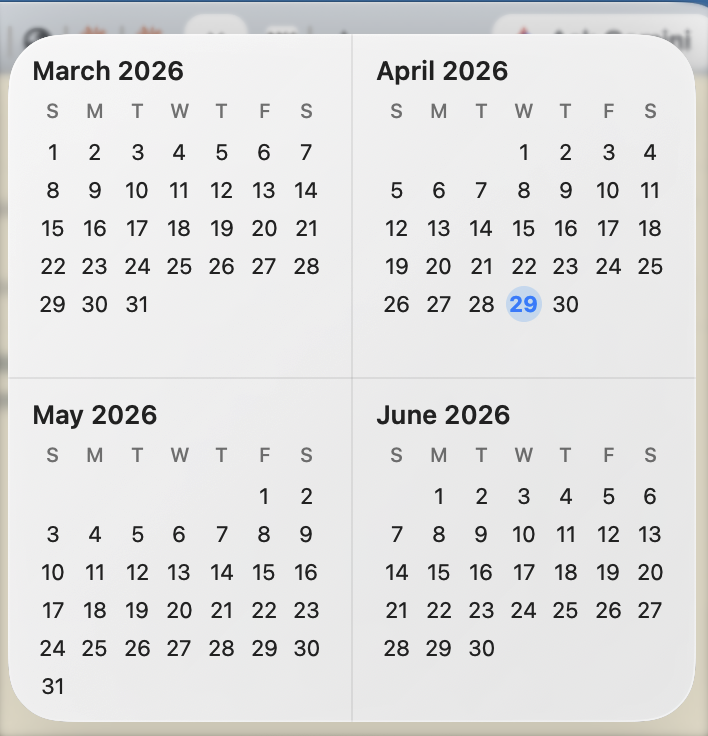
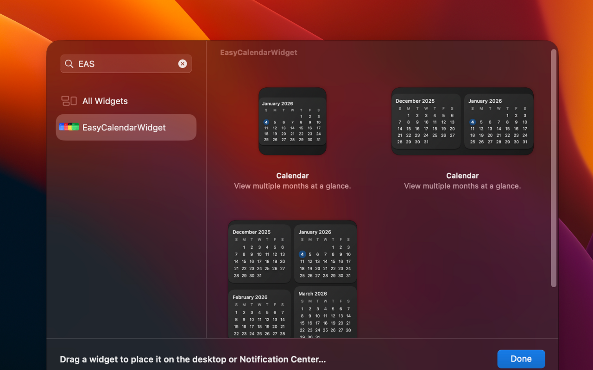

# Easy Calendar Widget

A clean, minimal calendar widget for macOS that displays multiple months on your desktop or Notification Center.

## Features

- **Multiple Sizes**: Small (1 month), Medium (2 months), or Large (4 months) widget options
- **Today Highlight**: Current day is visually highlighted for quick reference
- **Daily Updates**: Automatically refreshes at midnight to update the current day
- **Dark Mode Support**: Adapts to your system appearance with light and dark themes
- **Locale Aware**: Respects your system calendar settings for weekday order and date formatting

## Screenshots


*Large widget showing 4-month view on the desktop*


*All available widget sizes in the widget gallery*

## Requirements

- macOS 13.0 or later

## Installation

### Option 1: Mac App Store (Recommended)

[](https://apps.apple.com/app/easy-calendar-widget)

*Coming soon - pending App Store review*

### Option 2: Direct Download

1. Go to the [Releases](https://github.com/cdemeke/easy-calendar-widget/releases) page
2. Download the latest `EasyCalendarWidget.zip`
3. Unzip and drag `EasyCalendarWidget.app` to your `/Applications` folder
4. Open the app (you may need to right-click → Open the first time to bypass Gatekeeper)
5. Add the widget to your desktop:
   - Right-click on your desktop
   - Select "Edit Widgets..."
   - Find "Easy Calendar Widget" and drag it to your desktop

### Option 3: Build from Source

Requires Xcode 15.0+

1. Clone the repository:
   ```bash
   git clone https://github.com/cdemeke/easy-calendar-widget.git
   cd easy-calendar-widget
   ```

2. Open the project in Xcode:
   ```bash
   open EasyCalendarWidget.xcodeproj
   ```

3. Build and run the project (⌘R)

4. Add the widget to your desktop:
   - Right-click on your desktop
   - Select "Edit Widgets..."
   - Find "Easy Calendar Widget" and drag it to your desktop

## Usage

Once installed, the host app provides instructions for adding the widget:

1. Right-click on your desktop
2. Select "Edit Widgets..."
3. Find "Easy Calendar Widget" in the widget gallery
4. Drag your preferred size to your desktop or Notification Center

## Project Structure

```
├── EasyCalendarWidget/              # Host application
│   ├── EasyCalendarWidgetApp.swift  # App entry point
│   └── ContentView.swift            # Setup instructions UI
│
├── CalendarWidgetExtension/         # Widget extension
│   ├── CalendarWidget.swift         # Widget definition & timeline
│   ├── Models/
│   │   └── CalendarMonthModel.swift # Data models
│   ├── Builders/
│   │   └── CalendarMonthBuilder.swift # Calendar logic
│   └── Views/
│       ├── MonthView.swift          # Single month view
│       └── CalendarGridViews.swift  # Multi-month layouts
```

## Tech Stack

- **Swift 5** & **SwiftUI**
- **WidgetKit** for widget functionality
- No external dependencies

## License

MIT License - See [LICENSE](LICENSE) for details.
